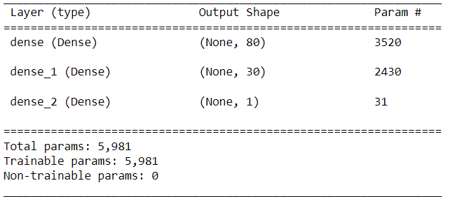
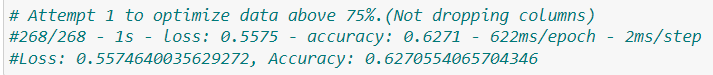
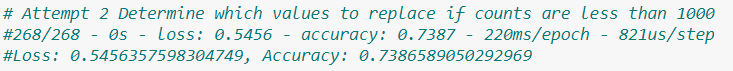
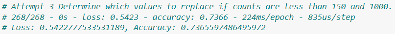
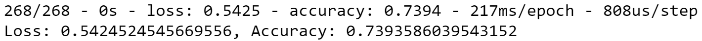
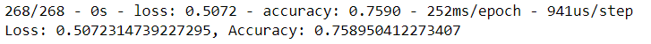

# Neural_Network_Charity_Analysis

## Overview of the analysis
Alphabet Soup’s business team, Beks received a CSV containing more than 34,000 organizations that have received funding from Alphabet Soup over the years. Within this dataset are a number of columns that capture metadata about each organization, such as the following:

EIN and NAME—Identification columns
APPLICATION_TYPE—Alphabet Soup application type
AFFILIATION—Affiliated sector of industry
CLASSIFICATION—Government organization classification
USE_CASE—Use case for funding
ORGANIZATION—Organization type
STATUS—Active status
INCOME_AMT—Income classification
SPECIAL_CONSIDERATIONS—Special consideration for application
ASK_AMT—Funding amount requested
IS_SUCCESSFUL—Was the money used effectively

Utilize Nueral Network Model to help the foundation predict where to make investments

## Results

### Data Preprocessing
- What variable are considered the target for your model?
 IS_SUCCESSFUL

- What variable(s) are considered to be the features for your model?
APPLICATION_TYPE, AFFILIATION, CLASSIFICATION, USE_CASE, ORGANIZATION, STATUS, INCOME_AMT, SPECIAL_CONSIDERATIONS, ASK_AMT   

- What variable(s) are neither targets nor features, and should be removed from the input data?
EIN and Name

### Compiling, Training, and Evaluating the Model

The neural network model has two hidden layers. The first hidden layer has 80 neurons and uses the ReLU activation function, while the second hidden layer has 30 neurons and also uses the ReLU activation function. The output layer has 1 neuron and uses the sigmoid activation function.

- Were you able to achieve the target model performance?
With the steps below I was unable to achieve an accuracy score above 75%. 

- What steps did you take to try and increase model performance?

## Summary: Summarize the overall results of the deep learning model. 
Neural networks capable of predicting with a 73% accuracy whether applicants will be successful if funded by Alphabet Soup. Now this is not the targeted range however I am still working on finding a solution utilizing pd.get_dummies on the name column. 

Current Results

Still testing results

## Recommendation for how a different model could solve this classification problem, and explain your recommendation.
Decision trees supervised learning algorithm 